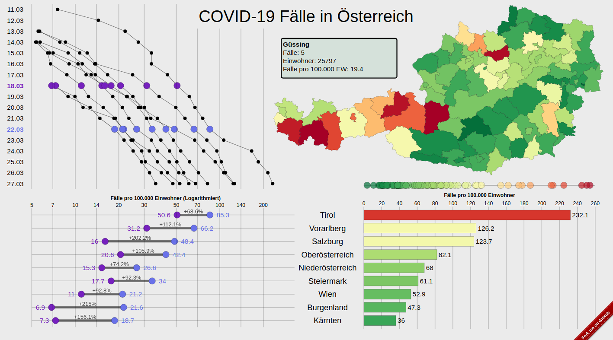

# d3-Dashboard zu Coronafällen in Österreich

Quelldateien für https://gregordecillia.github.io/d3-tests/map2/

Zeigt die Räumliche und zeitliche Verteilung der bestätigten Infektionen von COVID-19 Erkrankungen in Österreich. 

### Daten

Als Datengrundlage wird info.gesundheitsministerium.at verwendet. Details zu den Quellen können in [data](data) nachgelesen werden.

### Tools

Die Grafiken wurden mit dem JavaScript Paket [d3.js](https://d3js.org/) erstellt und verwenden Mausinteraktionen um zwischen unterschiedlichen Regionen (Bundesländern oder Bezirken) und unterschiedlichen Zeitpunkten zu navigieren.

Die Daten wurden mit [R](https://www.r-project.org/) in eine passende Form gebracht und in `.js` Dateien gespeichert.

### Screenshot

